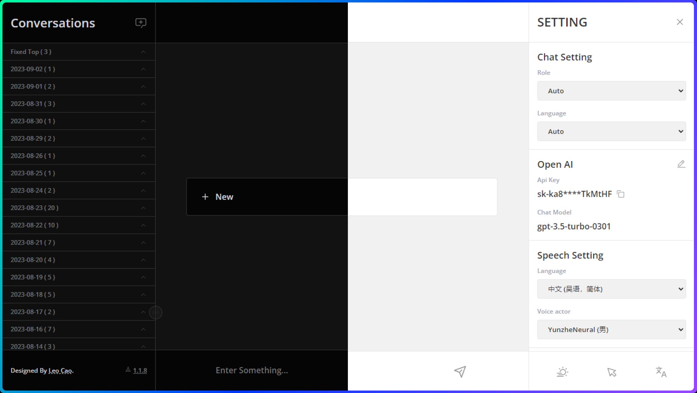
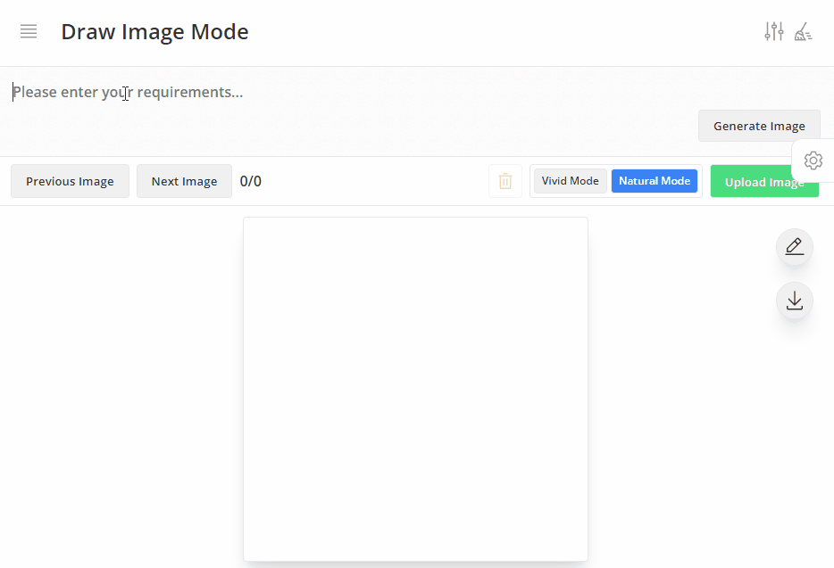
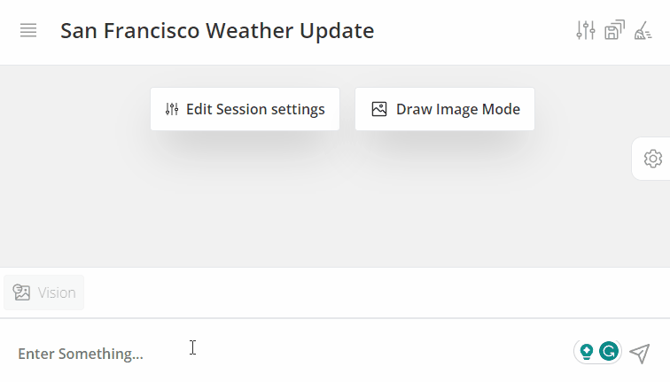
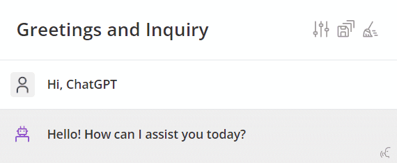
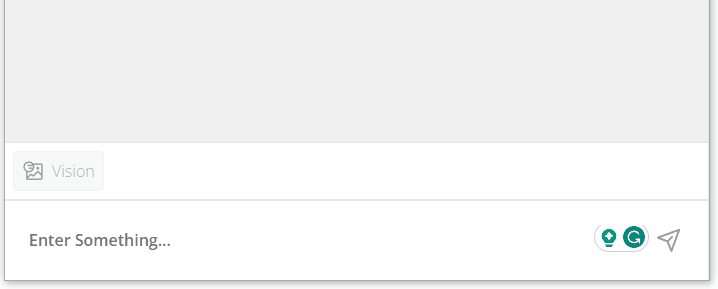

# GPT Next

> GPT Next是一个AI聊天工具，可以使用户与AI进行对话。该应用程序使用Vue.js作为前端框架，并利用IndexedDB作为数据库，以保证会话的隐私和安全性。

[🧭在线体验](https://gpt-next-shvd.vercel.app/)

## 特色功能截图 📷
| 绘图模式                               | Function Calling                            |
| -------------------------------------- | ------------------------------------------- |
|  |    |

| 文本转语音                             | 多媒体输入框                                |
| -------------------------------------- | ------------------------------------------- |
|         |  |

## 产品特点 🚀

- ⚔**会话记录保存**：该应用程序使用IndexedDB作为数据库，以保证会话的隐私和安全性。所有会话记录都被保存，以便以后访问。
- 🔗**持久会话模式**：该功能使AI记住对话的上下文，并提供更准确的答案。
- 🤹‍♀️**多个角色**：内置多种聊天角色，使AI的答案更准确。
- 👏**可读性**：利用微软的语音服务，消息可以变得可播放。

## 入门指南 🎯

### 要运行此项目，请按照以下步骤操作：

1. 将此存储库克隆到本地计算机上。
2. 在命令行中运行pnpm install以安装所有必要的依赖项。

### 使用Docker启动应用程序，请按照以下步骤操作：

1. Pull the repository (main branch).
2. Run docker build -t gpt_next:latest .
3. Run docker run -d -p 1003:8080 --name gpt_next --restart=always gpt_next:latest
4. 尽情享受！

### 或者，您可以按照以下步骤使用源代码运行应用程序：

1. Pull the repository (main branch).
2. Run pnpm install.
3. Run pnpm dev.
4. Enjoy!

## 🚧 功能清单

- [x] 会话记录保存
- [x] 持久会话模式
- [x] 多个角色
- [x] 支持图像生成
- [x] 支持编辑对话
- [x] 支持Function Calling调用
- [x] 支持Open AI 视觉API (预览版)
- [x] 支持Open AI 文本转语音API (TTS)

## Bug列表：

## 感谢：

- [anse-app/anse](https://github.com/anse-app/anse)
- [CatsJuice/ipad-cursor](https://github.com/CatsJuice/ipad-cursor)

## Star History

## 许可证：
MIT © [Leo Cao](https://github.com/Caojiahao-Coder)
